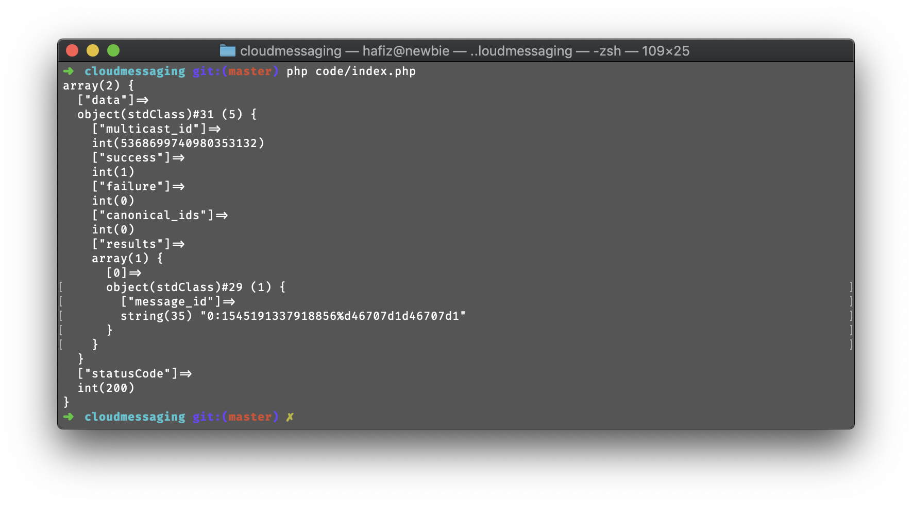
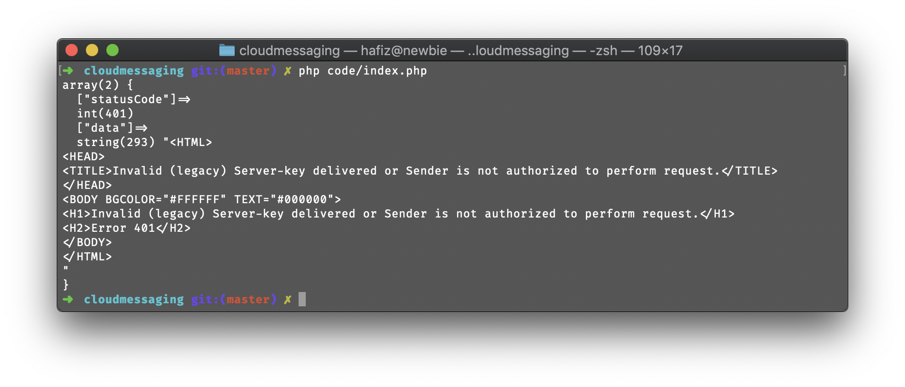

## Send Firebase Cloud Messaging on Single Device 

It is simple php functions to send Firebase Cloud Messaging
as written in [Firebase Docs](https://firebase.google.com/docs/cloud-messaging/send-message#send_messages_to_specific_devices_2) with cool [guzzle](https://github.com/guzzle/guzzle).

### Requirement
- PHP 5.6+
- guzzlehttp/guzzle

### Installation

Open terminal and go inside the folder 

```bash
$ cd path/to/the/project`
``` 

Then, run `composer install` to install the dependency

## Usage

First, open the `code/index.php` and update the `$token` and `$serverKey`.

Then, execute by opening from browser or simply run this command. `var_dump` output should similar as below. 

```bash
$ php code/index.php
```


Any errors/issues will also be displayed in the output (show below image).



## License
Licensed under the [MIT license](http://opensource.org/licenses/MIT)
